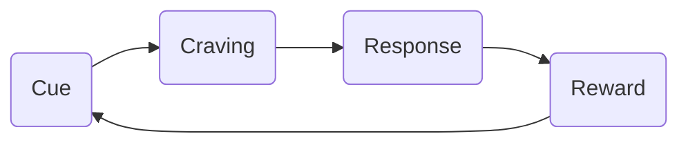

> We are what we repeatedly do. Excellence, then, is not an act, but a habit.

## Habit loop

- Habit loop
- Make it easier to do the habit
- Focus on the process rather than the goal
  - Quantity => Quality
- Identity <-> Habit feeding loop
- Actionable takeaways
