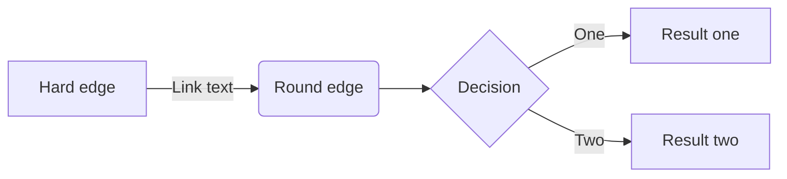

+++
title = "Sample post"
date = 1996-09-25
tags = ["test", "draft"]
draft = true
math = true
+++



Use `` shortcode to generate a table of contents.

## Headings

## H2

### H3

#### H4

##### H5

## Text styling

**Bold** and *italic*.

## Lists

### Unordered

- Dogs
- Cats
  - Abyssinian
  - Siamese
- Cows

### Ordered

1. Build a blog.
    1. Find good static site generator.
    2. Select a theme.
        - Shouldn't be too complicated.
        - Shouldn't take too long to setup.
2. Congrats!

## Footnote

Here is a simple footnote[^1]. With some additional text after it.

## Table

| Column 1 | Column 2 |
| --- | --- |
| Value 1 | Value 2 |

## Code

Some text `inline code` some more text.

```c++
class Foo {
public:
  Foo(int x);
};

int main() {
  std::vector vec = {1, 2, 3};
  vec[42] = x;
  std::string s = "Hello, world!";
  return 0;
}
```

And after.

```go {linenos=inline,hl_lines=[8,"15-17"],linenostart=199}
// GetTitleFunc returns a func that can be used to transform a string to
// title case.
//
// The supported styles are
//
// - "Go" (strings.Title)
// - "AP" (see https://www.apstylebook.com/)
// - "Chicago" (see https://www.chicagomanualofstyle.org/home.html)
//
// If an unknown or empty style is provided, AP style is what you get.
func GetTitleFunc(style string) func(s string) string {
  switch strings.ToLower(style) {
  case "go":
    return strings.Title
  case "chicago":
    return transform.NewTitleConverter(transform.ChicagoStyle)
  default:
    return transform.NewTitleConverter(transform.APStyle)
  }
}
```

## Quotes

> This is a single quote.

Some text in-between.

> This is a
> multi line
> quote

And nested quotes.

> Dorothy followed her through many of the beautiful rooms in her castle.
>
>> The Witch bade her clean the pots and kettles and sweep the floor and keep the fire fed with wood.

## Math

$$
i \hbar \frac{\partial}{\partial t}\Psi(\mathbf{r},t) = \hat H \Psi(\mathbf{r},t)
$$

## Gist



## YouTube



## Mermaid diagrams



## Emoji

😀😸🤡💃💅💥⚡✏⚠⤴⤵

:us:

[^1]: My reference.
